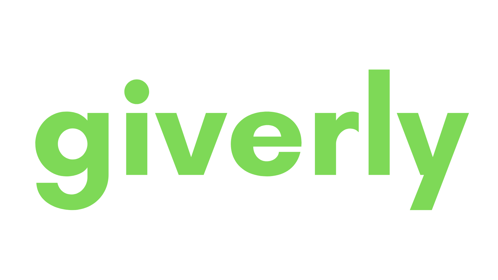

# GIVERLY

&nbsp;

&nbsp;

***
## Date: 05/16/2022

### By: 

#### Jenna Allgeier | [Github](https://github.com/jenna-allgeier) | [LinkedIn](https://www.linkedin.com/in/jenna-allgeier/)

&nbsp;
## ***DESCRIPTION***
### Never forget a birthday/graduation/anniversary again!

Take care of all your gift-giving for the year by simply adding the important dates to a calendar and picking out a gift from one of our supported stores. Once your dates and gifts are set-up, you're done! Giverly will automatically add the item to your cart two weeks before the special date and send you an alert. Just go into your cart, press order and voila! Giverly takes the stress out of gifting.

### MVP:

* Welcome Page:
  * button to login & button to sign-up
* Login:
  * sign-up form & register form
* User Info:
  * First Name
  * Last Name
  * Username
  * Email
  * Password
* Calendar
  * (CRUD) calendar items
* Orders:
  * makes calls to ECart API
  * item name
  * price
  * image
&nbsp;

### ***App Screenshots:***

### ****Home Page****

### ****Login and Register****

### ****Feed**** 

### **DEPLOYED APP AT [Coming soon!]()**

### ***Technologies***

* HTML
* CSS
* JavaScript
* TypeScript
* React.js
* Redux
* Django
* Python
* Heroku

&nbsp;
### **Instructions for Developers**
* Fork and clone this repo.

&nbsp;
### **Known Issues**
* None yet!

&nbsp;
### ***Future Updates***
* Automate cart ordering

&nbsp;

### **BUILDING PLAN**

##### **CHECK OUT MORE ON [TRELLO](https://trello.com/invite/b/artS1Pwv/ec83e0315e1ba426c39c293781f720de/giverly)**

##### **LINK TO THE [ERD](https://drive.google.com/file/d/1-cOzkpCzTNDkAvlA43sFyUmChHMm8VFw/view?usp=sharing)**

##### **LINK TO THE [CHD](https://drive.google.com/file/d/1S2vc1W-37NNE69ydtKRENHX5VDEr8bEM/view?usp=sharing)**

&nbsp;

### ***Credits***

- https://stackoverflow.com/
- https://www.w3schools.com/css/css3_buttons.asp
- https://designs.ai/colors/
- https://www.google.com/imghp?hl=en&ogbl
